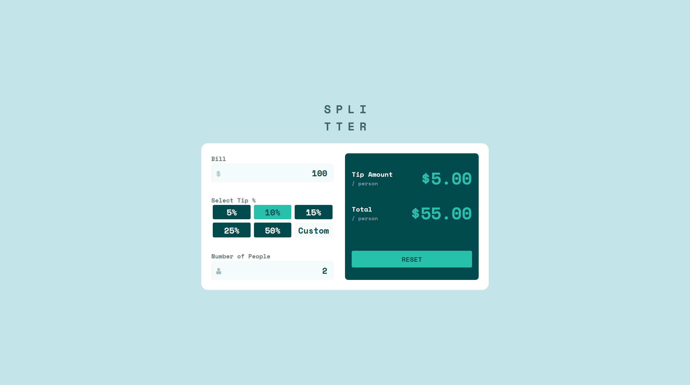
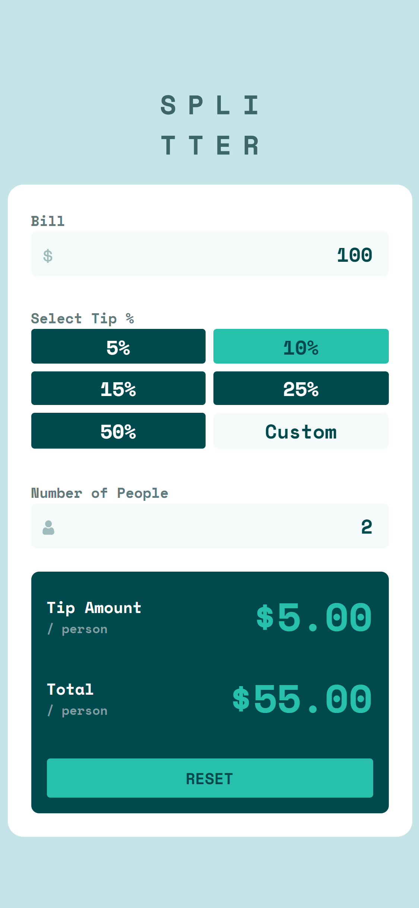

# Frontend Mentor - Tip calculator app solution

This is a solution to the [Tip calculator app challenge on Frontend Mentor](https://www.frontendmentor.io/challenges/tip-calculator-app-ugJNGbJUX).

## Table of contents

- [Overview](#overview)
  - [The challenge](#the-challenge)
  - [Screenshot](#screenshot)
  <!-- - [Links](#links) -->
- [My process](#my-process)
  - [Built with](#built-with)
  - [What I learned](#what-i-learned)
  - [Continued development](#continued-development)
  <!-- - [Useful resources](#useful-resources) -->
- [Author](#author)
<!-- - [Acknowledgments](#acknowledgments) -->

## Overview

### The challenge

Users should be able to:

- View the optimal layout for the app depending on their device's screen size ✔️
- See hover states for all interactive elements on the page ✔️
- Calculate the correct tip and total cost of the bill per person ✔️

### Screenshot




### Links

- You can see [my solution here](https://www.frontendmentor.io/solutions/tip-calculator-app-gKJCg6ZXJR)
- View the [live site demo here](https://tip-calc-app-xi.vercel.app/)

## My process

### Built with

- [React](https://reactjs.org/) - JS library
- CSS modules

### What I learned

By attempting this challenge, I got to better understand how _React_ useContext and useReducer hooks work.
Using them in this project has made me realise how so much easier it is to use these hooks rather than just straight props drilling.
It also clarifies how _React_ makes building so much easier in general. Being able to handle the logic and mark-up so seamlessly feels so much more intuitive for me and I look forward to building more with _React_ 😉

<!-- ```html
<h1>Some HTML code I'm proud of</h1>
```

```css
.proud-of-this-css {
  color: papayawhip;
}
```

```js
const proudOfThisFunc = () => {
  console.log("🎉");
};
``` -->

### Continued development

Going further, I'm going to better my skills with useReducer and useContext. I will do more with them and also learn other, more productive ways to manage state.
Please feel feel free to suggest better ways I could have tackled this project or do a PR to fix or point out any problems you might find 🙂

<!-- ### Useful resources

- [Example resource 1](https://www.example.com) - This helped me for XYZ reason. I really liked this pattern and will use it going forward.
- [Example resource 2](https://www.example.com) - This is an amazing article which helped me finally understand XYZ. I'd recommend it to anyone still learning this concept.

**Note: Delete this note and replace the list above with resources that helped you during the challenge. These could come in handy for anyone viewing your solution or for yourself when you look back on this project in the future.** -->

## Author

<!-- - Website - [Add your name here](https://www.your-site.com) -->

- Frontend Mentor - [@memoye](https://www.frontendmentor.io/profile/memoye)
- Twitter - [@memoye_io](https://www.twitter.com/memoye_io)

<!-- ## Acknowledgments

This is where you can give a hat tip to anyone who helped you out on this project. Perhaps you worked in a team or got some inspiration from someone else's solution. This is the perfect place to give them some credit.

**Note: Delete this note and edit this section's content as necessary. If you completed this challenge by yourself, feel free to delete this section entirely.** -->
